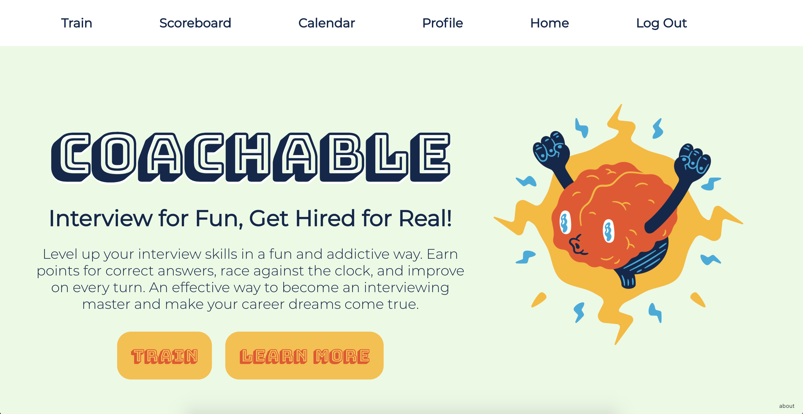
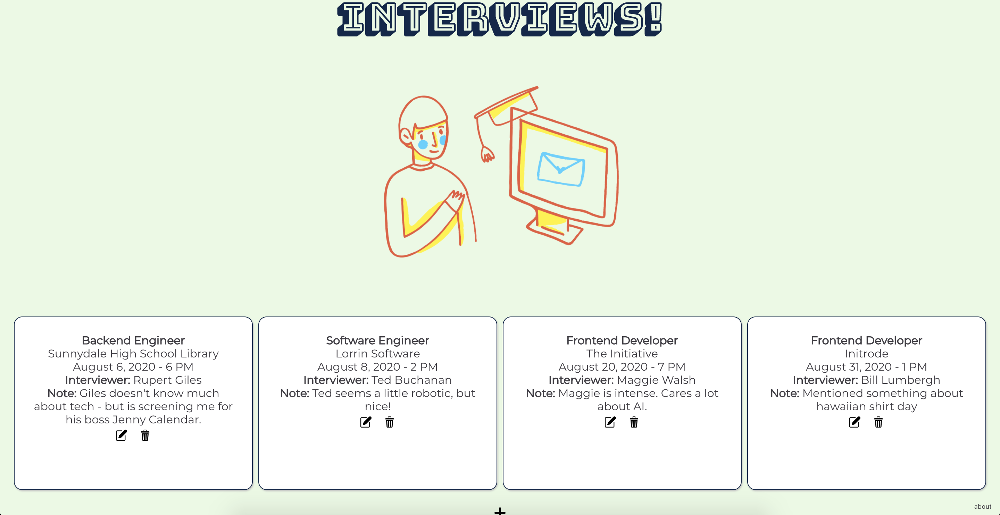
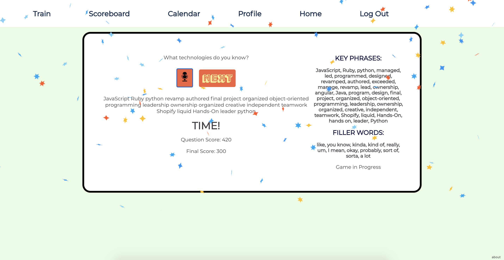

<h1>Coachable</h1>
<h4>Interview for fun, get hired for real!</h4>

Coachable is a fun and easy way to become a better interviewee, faster. Answer questions and race the clock while being scored on what you say (or don't say!). Enter questions from previous interviews to train, and see how your results stack up on the scoreboard.
 

<h2>About this Project</h2>

Coachable is built with a React frontend and Rails backend and PostgreSQL for database management. It uses Web Speech API for voice recognition and voice-to-text, along with React Confetti component with some custom Canvas. 

illustrations by <a href="https://dribbble.com/thierryfousse">Thierry Fousse</a> & <a href="http://www.Vecteezy.com">Vecteezy</a>, Music from <a href="http://PlayonLoop.com">Play On Loop</a>. Icons made by <a href="https://www.flaticon.com/authors/prosymbols" title="Prosymbols">Prosymbols</a> from <a href="https://www.flaticon.com/" title="Flaticon"> www.flaticon.com</a>. Everything else - [me](mailto:rosie.wilt@gmail.com)! 
      

<h2>How to Install</h2>
<ul>
  <li>Fork and clone both repos</li>
  <li>Navigate to this directory</li>
  <li>'npm install && npm start' on the frontend, 'rails db:seed && rails s'  on the backend</li>
</ul>

<h2>How to Play</h2>
<ul>
  <li>Head to the 'train' section to start the game and follow the instructions</li>
  <li>You will be scored on each question and given a final score</li>
</ul>

<h2>Screenshots</h2>

 

<h2>Demo</h2>

https://https://www.youtube.com/watch?v=R-Js3u5uoEE
